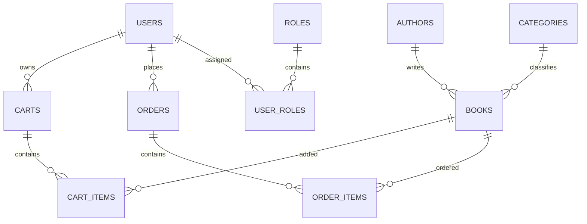

# Database Schema

The database is created with EF Core Code First.

Core tables:

- `Users`, `Roles`, `UserRoles`, plus standard Identity claims/login/token tables.
- `Authors`, `Categories`, `Books`.
- `Carts`, `CartItems`.
- `Orders`, `OrderItems`.

Important constraints:

- Unique book ISBN.
- Unique category name.
- Unique order number.
- One cart per user.
- Decimal precision `18,2` for money.
- Restricted deletes for book history and cascade deletes for cart/order child rows.
